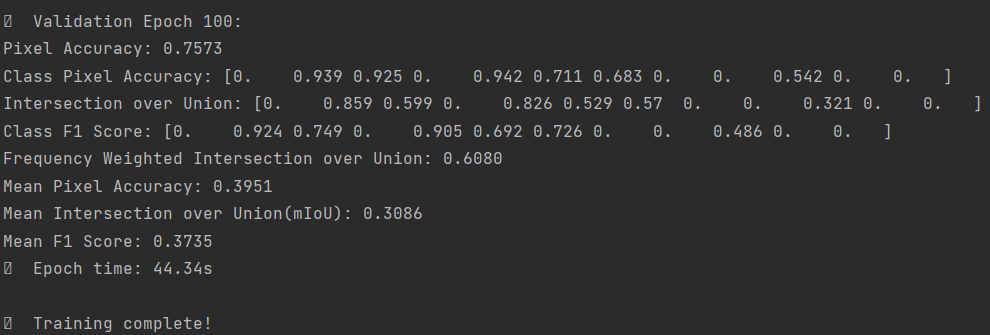
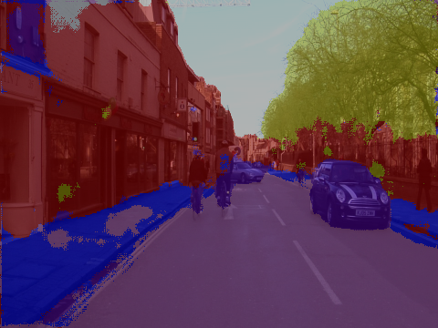
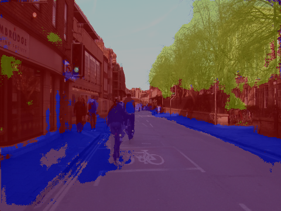

# UNet CamVid Semantic Segmentation


## Overview

This repository is a cleaned semantic-segmentation project for the CamVid dataset using a UNet model in PyTorch. It focuses on the core training, prediction, dataloader, and metric code while keeping a few visual outputs for quick preview.

## Preview



| Overlay 1 | Overlay 2 |
| --- | --- |
|  |  |

## Highlights

- UNet-based road-scene segmentation pipeline
- CamVid dataloader with color-map helpers
- prediction script for single images and directories
- example outputs preserved for repository preview

## Project Structure

- `train.py`: training script
- `test.py`: prediction script for single images or directories
- `datasets/CamVid_dataloader11.py`: dataloader and color-map helpers
- `model/`: UNet model definition
- `metric/`: segmentation metric implementation
- `sample_predictions/`: example prediction outputs
- `figures/`: training screenshot

## Setup

```bash
pip install -r requirements.txt
```

## Usage

Train:

```bash
python train.py --data_root ./CamVid --epochs 50 --batch_size 8
```

Predict:

```bash
python test.py --image_dir ./datasets/test --checkpoint ./checkpoint/unet_best.pth --overlay
```

## Notes

- The full CamVid dataset and trained checkpoints are intentionally excluded.
- This repository is meant as a clean project snapshot and demo page rather than a full experiment archive.
